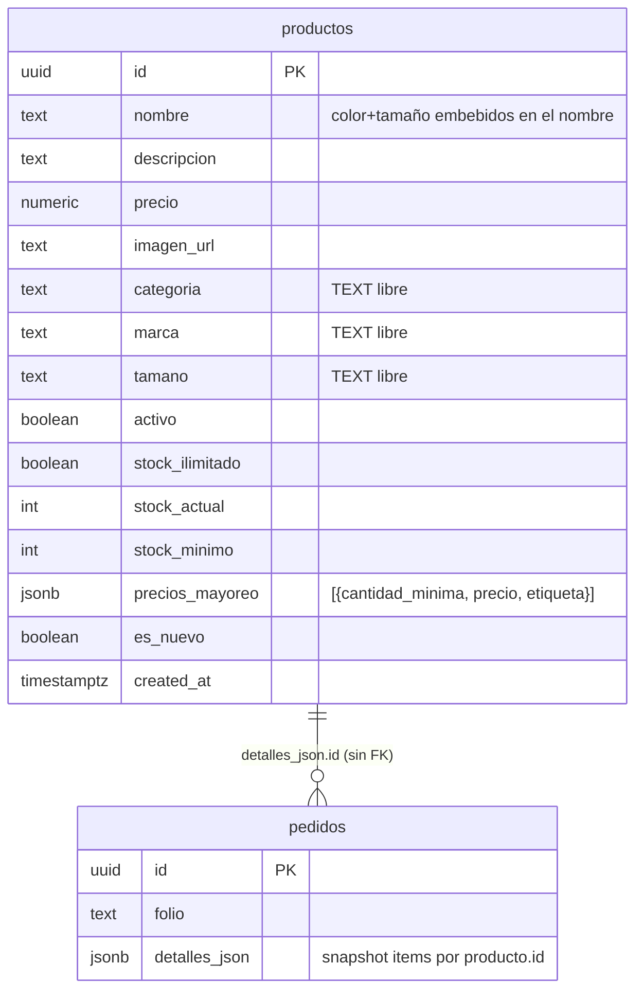
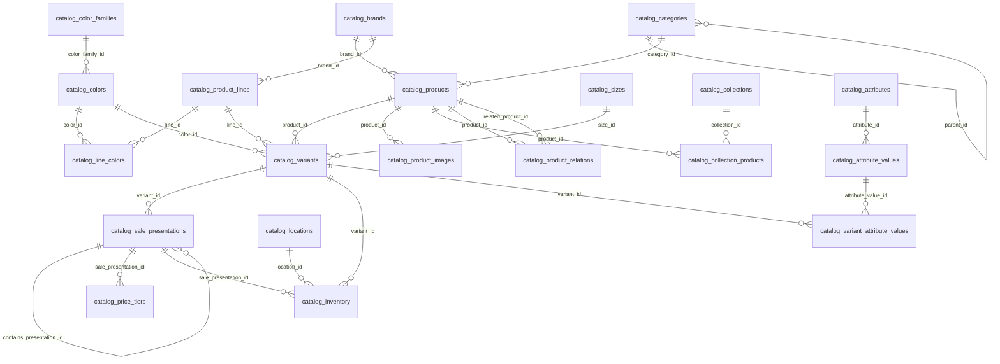

# Fase 1 — Auditoría del Catálogo V1 y Diseño V2

Fecha: 2026-07-27 · Rama: `refactor/catalog-v2`

## 1. Resumen ejecutivo

El catálogo actual vive en una única tabla plana `public.productos` (~16 columnas).
Cada combinación color/tamaño es una fila independiente: el respaldo real muestra
**105 productos activos**, de los cuales 44 son "Globo Latex ... 12 Pulg" — una
tarjeta por color. Categorías, marcas y tamaños son TEXT libre sin integridad
referencial (ej. categorías reales mezcladas: `Globo Latex`, `Orbz`, `Batucada`,
`Primera Comunión`, `Frutas`). El mayoreo se guarda como JSONB
`precios_mayoreo` con llaves heterogéneas (`cantidad_minima`, `precio`, `etiqueta`).

La V2 normaliza el dominio en 18 tablas `catalog_*` con variantes, presentaciones
anidadas, escalones de precio, inventario multisucursal y facetas/búsqueda del
lado de Supabase.

**Línea base verificada antes de tocar nada:** `npm test` → 110/110 ✓ ·
`npm run build` → ✓ (8.4s).

## 2. Respaldo de productos (entregable)

| Respaldo | Ubicación | Cobertura |
|---|---|---|
| Export REST (JSON + CSV) | `backups/catalog-v1/2026-07-27-15-23-11/` | 105 filas **activas** (RLS con anon key oculta inactivos) |
| Respaldo en base de datos | `001_catalog_backup_and_cleanup.sql` → tabla `productos_backup_v1` | **Total** (incluye inactivos). Pendiente de ejecutar en SQL Editor |

Script reproducible: `node scripts/backup-catalog-v1.mjs`
(con `SUPABASE_SERVICE_ROLE_KEY` exporta también los inactivos).

Distribución real exportada: 17 categorías TEXT, 6 marcas, 11 tamaños TEXT;
105/105 productos traen `precios_mayoreo`; solo 1 usa `stock_ilimitado=false`.

## 3. Mapa de dependencias de `public.productos`

### 3.1 Código — lectura pública del catálogo

| Archivo | Uso |
|---|---|
| `src/lib/productosPublicos.js` | `fetchPublicProductPage`, `fetchAllPublicProducts`, `fetchPublicCatalogFacets` (vista `catalogo_facetas_publicas`). Campos: `PUBLIC_PRODUCT_FIELDS` |
| `src/hooks/useCatalogProducts.js` | Hook del catálogo público: paginación, caché `fp_catalog_pages_v2`, suscripción Realtime a `productos` |
| `src/hooks/useProductos.js` | Carga completa + Realtime (INSERT/UPDATE/DELETE). Usado por landing `NovedadesSection` |
| `src/App.jsx` | Catálogo público (consume `useCatalogProducts` + `useCarrito`) |
| `src/components/BuscadorFiltros.jsx`, `SidebarFiltrosDesktop.jsx`, `ModalFiltros.jsx`, `ProductGrid.jsx`, `ProductCard.jsx`, `ProductoDetalleModal.jsx`, `SearchPanel.jsx` | UI de catálogo; precio vía `utils/precios.js` |
| `src/utils/fuzzySearch.js` | Fuse.js sobre productos descargados |
| `src/utils/catalogSeo.js`, `src/contexts/CatalogSeoContext.jsx`, `src/utils/structuredData.js` | SEO por categoría (lee `configuracion.catalogo_categorias`) |
| `api/product-preview.js` | Función serverless: OG preview consultando `productos` por REST |
| `src/data/productos.js` | Registros dinámicos `categorias`/`marcas`/`tamanios` pobladores desde filas de `productos` |
| `src/lib/validacionCarrito.js` | Revalida carrito contra `fetchPublicProductPage` |

### 3.2 Código — carrito, pedidos, mayoreo

| Archivo | Uso |
|---|---|
| `src/hooks/useCarrito.js` | Identidad de renglón = `producto.id`; stock `stock_actual`/`stock_ilimitado`; `sincronizarStock` |
| `src/components/CarritoDrawer.jsx` | Checkout; calcula `obtenerPrecioAplicable` |
| `src/hooks/usePedido.js` → `src/lib/pedidosPublicos.js` | Snapshot de item `{id, nombre, precio, precio_base, cantidad, imagen_url, tamano, precios_mayoreo, familia_mayoreo}` → RPC `crear_pedido_publico` |
| `src/utils/precios.js` | `obtenerEscalasMayoreo`, `obtenerPrecioAplicable`, `obtenerSiguienteEscalaMayoreo` sobre `precios_mayoreo` JSONB |
| `src/utils/whatsapp.js` | Mensaje con nombre/cantidad/precio aplicado/subtotal por item |
| `src/pages/admin/pedidos/components/ListaArticulos.jsx` | Picking: descuenta `stock_actual` directo en `productos` |
| `src/hooks/usePedidosAdmin.js` | Restaura stock al cancelar (update directo a `productos`) |

### 3.3 Código — panel admin

| Archivo | Uso |
|---|---|
| `src/components/AdminCatalogo.jsx` (1488 líneas) | CRUD productos, import CSV, gestión categorías/marcas/tamaños, anuncio |
| `src/components/FormularioNuevoProducto.jsx`, `ModalEditarProducto.jsx`, `src/hooks/useProductForm.js` | Formularios de alta/edición |
| `src/lib/productosAdmin.js` | Insert/update/delete, rename en cascada por TEXT, subida de imágenes a Storage |
| `src/pages/admin/inventario/hooks/useInventario.js` | Tabla de stock en tiempo real |
| `src/pages/admin/dashboard/hooks/useDashboardData.js` | Top productos (join implícito por nombre) |

### 3.4 Objetos SQL actuales del dominio del catálogo

| Objeto | Tipo | Archivo origen | Destino en V2 |
|---|---|---|---|
| `public.productos` | tabla | `supabase_setup.sql` + `supabase_inventario_migration.sql` (+ cols `es_nuevo`, `precios_mayoreo`, `familia_mayoreo` añadidas después) | Reemplazada por `catalog_*`; se elimina en `007` |
| `idx_productos_*` (6 B-tree + 5 trgm GIN) | índices | `supabase_setup.sql`, `supabase_catalog_scalability.sql`, `supabase_inventario_migration.sql` | Caen con la tabla |
| `catalogo_facetas_publicas` | vista | `supabase_catalog_scalability.sql` | Reemplazada por RPC `catalog_get_facets` |
| Policies `productos_*` (5) | RLS | `supabase_security_hardening.sql` | Policies nuevas por tabla `catalog_*` |
| `canonicalize_public_pedido()` + trigger `zzz_canonicalize_public_pedido_before_insert` | función/trigger | `supabase_order_integrity.sql` | **Reescrito** para snapshot V2 (variante + presentación) |
| Grants sobre `productos` | permisos | hardening/fixes | Se retiran en `007` |
| Realtime publication `productos` | replicación | `supabase_setup.sql` | Se retira en `007`; se evalúa publicar `catalog_inventory` |

### 3.5 Objetos SQL que NO se tocan (fuera del catálogo)

`admins`, `profiles`, `profiles_pending`, `configuracion`, `push_subscriptions`,
`pedidos` (solo cambia el *formato* de `detalles_json`, no la tabla),
`has_role()`, `get_invite_by_token()`, `check_email_exists()`,
`handle_new_user()`, `normalize_public_pedido()`, `validate_pedido_update()`,
`check_pedido_rate_limit()`, `check_pedido_duplicate()`,
`crear_pedido_publico()` (se extiende, no se elimina),
`buscar_pedido_por_folio()`, policies de pedidos/config/push.

## 4. Modelo actual (V1)



Problemas estructurales confirmados con datos reales:

1. Una fila por color → 44 tarjetas de "Glomex … Estándar 12 Pulg".
2. Categoría/marca/tamaño sin integridad (renombrar = UPDATE masivo por texto).
3. Mayoreo en JSONB sin validación ni escalones por presentación.
4. Sin concepto de presentación (bolsa/caja), contenido ni unidad base.
5. Stock único por producto; sin sucursales; descuadre al mezclar bolsas/cajas.
6. El cliente React recalcula precios; el trigger `canonicalize_public_pedido`
   los recalcula de nuevo con lógica duplicada.

## 5. Modelo nuevo (V2)



Cadena conceptual obligatoria:
**Categoría → Familia (producto) → Marca → Gama (línea) → Color exacto →
(familia de color) → Medida → Variante → Presentación → Escalón de precio →
Inventario (por sucursal).**

Decisiones de diseño clave:

- `catalog_products.listing_group_mode` (`product`|`line`) decide si la tarjeta
  pública agrupa por familia completa o por gama (para globos: una tarjeta por
  gama, p.ej. "Glomex Estándar — 18 colores").
- Variante = combinación válida `(product_id, line_id, color_id, size_id)`;
  UNIQUE anulable con `NULLS NOT DISTINCT` para impedir duplicados aun con
  columnas opcionales (productos sin gama/color/medida).
- Presentaciones anidadas con `contains_presentation_id` + `base_units_total`;
  trigger impide ciclos.
- `catalog_price_tiers` con EXCLUDE constraint (rango `int4range`) para
  impedir escalones superpuestos por presentación.
- Inventario por `(variant_id, sale_presentation_id, location_id)` con
  `quantity - reserved_quantity` como disponible; política
  `shared_base_units` | `separate_by_presentation` por variante.
- Atributos genéricos EAV (`catalog_attributes` + valores) para no-globos
  (material, capacidad, personaje, tema…).

## 6. Lista de archivos afectados (por fase)

**Fase 2 (BD):** 7 archivos nuevos `001_catalog_*.sql … 007_catalog_*.sql` en raíz.

**Fase 3 (capa de datos):** nuevos `src/services/catalog/*.js`,
`src/hooks/catalog/*.js`; deprecan `productosPublicos.js`, `useProductos.js`,
`useCatalogProducts.js`, `utils/precios.js`.

**Fase 4 (admin):** `AdminCatalogo.jsx`, `FormularioNuevoProducto.jsx`,
`ModalEditarProducto.jsx`, `useProductForm.js`, `productosAdmin.js`,
`useInventario.js` → nuevas páginas `src/pages/admin/catalogo/`.

**Fase 5 (público):** `App.jsx`, `ProductCard/Grid`, `ProductoDetalleModal`,
`BuscadorFiltros`, `SidebarFiltrosDesktop`, `ModalFiltros`, `SearchPanel`,
`PublicCatalogRoute`, `AppRouter` (URLs nuevas), `catalogSeo`,
`api/product-preview.js`.

**Fase 6 (carrito/pedidos):** `useCarrito.js`, `CarritoDrawer.jsx`,
`usePedido.js`, `pedidosPublicos.js`, `validacionCarrito.js`,
`utils/whatsapp.js`, `ListaArticulos.jsx`, `usePedidosAdmin.js`,
`canonicalize_public_pedido()` (SQL).

**Fase 7 (limpieza):** eliminar archivos deprecados y `public.productos`.

**Sin tocar:** auth, usuarios, perfiles, invitaciones, configuración general,
anuncios, push, pagos, clientes, reportes, dashboard, landing, blog, PWA shell.

## 7. Riesgos detectados

| # | Riesgo | Mitigación |
|---|---|---|
| R1 | Trigger `canonicalize_public_pedido` reescribe `detalles_json` con el formato V1; mientras V2 conviva debe reescribirse en la misma migración que el RPC de pedidos V2 | Fase 6 incluye la reescritura atómica del trigger + RPC; pedidos viejos ya guardados no se migran (snapshot histórico) |
| R2 | Picking (`ListaArticulos`) y cancelación (`usePedidosAdmin`) descuentan/restauran stock directo en `productos` | Se reemplazan por RPC transaccional `catalog_apply_order_inventory` en Fase 6 |
| R3 | `api/product-preview.js` (Vercel serverless) consulta `productos` por REST para OG tags | Se actualiza en Fase 5 a la vista pública V2 |
| R4 | SEO: `configuracion.catalogo_categorias` y meta por slug de categoría TEXT | Fase 5 mapea slugs nuevos + redirecciones 301 de slugs viejos |
| R5 | Cachés de cliente (`fp_catalog_pages_v2`, `carritoPWA`, SW) con formato V1 | Bump de versiones de caché + limpieza controlada al cargar V2 (Fases 5–6); SW version bump |
| R6 | Realtime: admin edita variantes → tarjetas públicas deben refrescarse | Suscripción a `catalog_variants`/`catalog_inventory` filtrada + revalidación de la query activa |
| R7 | Sin CLI ni service key: las migraciones se aplican vía SQL Editor manual | Archivos idempotentes, ordenados, con verificación al final de cada uno + script de rollback |
| R8 | `familia_mayoreo` (columna legacy opcional, puede no existir en BD real) | No se migra; V2 usa escalones por presentación |
| R9 | El dashboard "top productos" parsea `detalles_json` por nombre | Snapshot V2 guarda nombre denormalizado → el parser sigue funcionando; verificar en Fase 6 |

## 8. Plan de migración

1. **Backup** — ✔ export REST (105 activas) + `001` crea `productos_backup_v1` en BD.
2. **Schema** — `002` crea 18 tablas `catalog_*` (sin tocar V1).
3. **Constraints/índices** — `003` (FKs, UNIQUE, EXCLUDE, checks, trigram).
4. **RLS** — `004` (público lectura de activos; escritura solo roles del panel).
5. **Funciones** — `005` (RPCs: tarjetas, detalle, facetas, búsqueda,
   validación de carrito, creación de pedido V2, utilidades de presentaciones).
6. **Seed** — `006` (categorías jerárquicas, marcas, gamas, familias de color,
   colores, medidas, sucursales, atributos, alias de búsqueda).
7. **Importación controlada** — script que transforma el respaldo V1 a filas V2
   (revisión humana; nada de mapeo por similitud de nombres automático en BD).
8. **App refactor** (Fases 3–6) contra el nuevo esquema.
9. **Limpieza** — `007` elimina V1 solo cuando ningún código lo consulte.
10. **Rollback** — `007_rollback` mantiene `productos_backup_v1` y recrea la
    tabla V1 desde el backup mientras dure la refactorización.

## 9. Pendientes / bloqueos para Fase 2

- **Credenciales de base de datos:** solo existe la publishable/anon key
  (`sb_publishable_…`). No hay Supabase CLI, service role key ni connection
  string. → Las migraciones `001…006` se entregarán listas para ejecutar en el
  **SQL Editor del dashboard de Supabase** (orden numerado). Esto NO bloquea la
  escritura ni la validación sintáctica de los archivos.
- El backup en base de datos (`productos_backup_v1`) quedará confirmado al
  ejecutar `001`.
```
